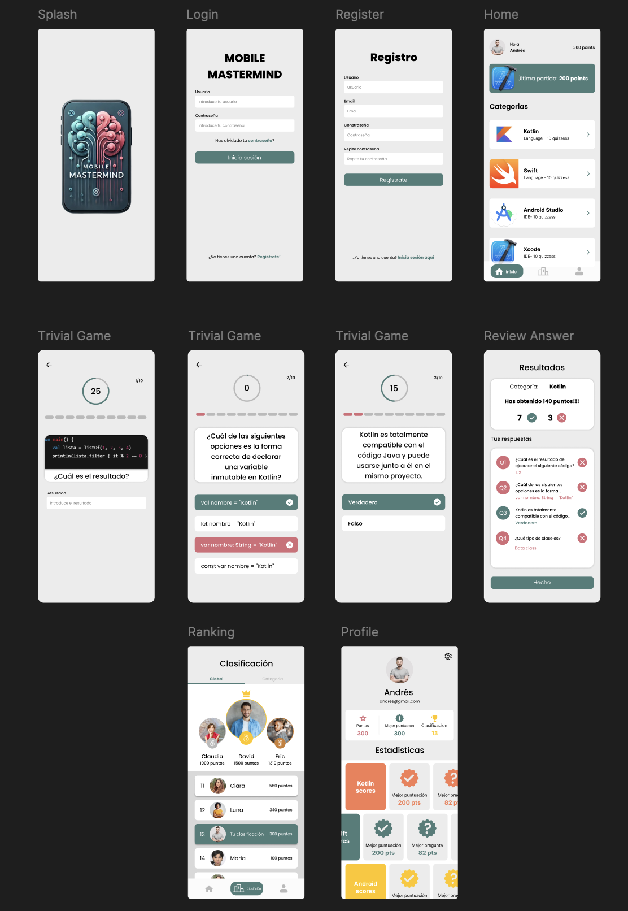

# 📱 Mobile Mastermind 📱

**Mobile Mastermind** es una app de trivial diseñada **por y para desarrolladores móviles**, con el objetivo de convertir el aprendizaje técnico en una experiencia **competitiva, divertida y dinámica**. Si eres desarrollador Android o iOS y quieres poner a prueba tus conocimientos de Kotlin, Swift, Android Studio y Xcode, ¡esta app es para ti!

---

## 🔎 Objetivos del proyecto:
- **Aprendizaje continuo:** Preguntas prácticas y actuales sobre tecnologías clave en desarrollo móvil.
- **Competencia saludable:** Rankings globales y categorías para motivarte y medir tu progreso.
- **Networking y comunidad:** Comparte conocimientos, compite y conecta con otros desarrolladores.

---

## 🎨 Características clave:

- **Interfaz minimalista:** Diseño limpio para una experiencia de usuario fluida y sin distracciones.
- **Preguntas con temporizador:** Añade adrenalina a cada pregunta y mejora la retención del aprendizaje.
- **Estadísticas detalladas:** Consulta tu progreso y compite para alcanzar el top 1 global.
- **Feedback inmediato:** Aprende de tus errores tras cada pregunta para mejorar continuamente.

---

## 🛠️ Tecnologías utilizadas:
- **Lenguaje:** Swift.
- **Herramientas:** Xcode y SwiftUI, Figma para el diseño y Gitflow para la gestión del código.
- **Metodologías:** Gitflow para control de versiones y enfoque ágil para el desarrollo.

---

## 🤝 Cómo contribuir:
Si quieres contribuir al proyecto, reportar errores o proponer nuevas categorías de preguntas, no dudes en abrir un **issue** o realizar un **pull request**. ¡Nos encantaría recibir tu aporte!

---

## 📩 Contacto:
Si tienes alguna duda o simplemente quieres conectar, puedes contactarme a través de mi perfil de GitHub o LinkedIn.

---

### 💡 ¡Aprende, compite y conecta con Mobile Mastermind!
